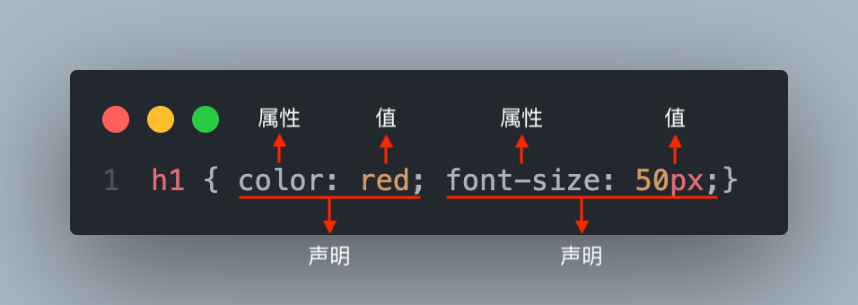
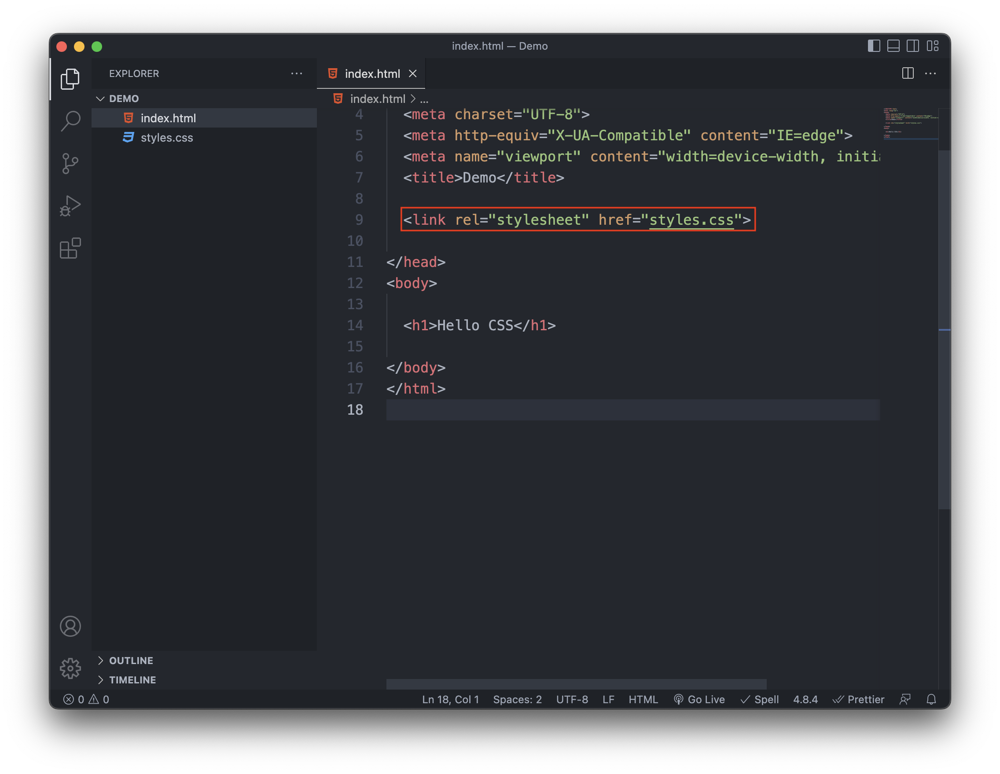
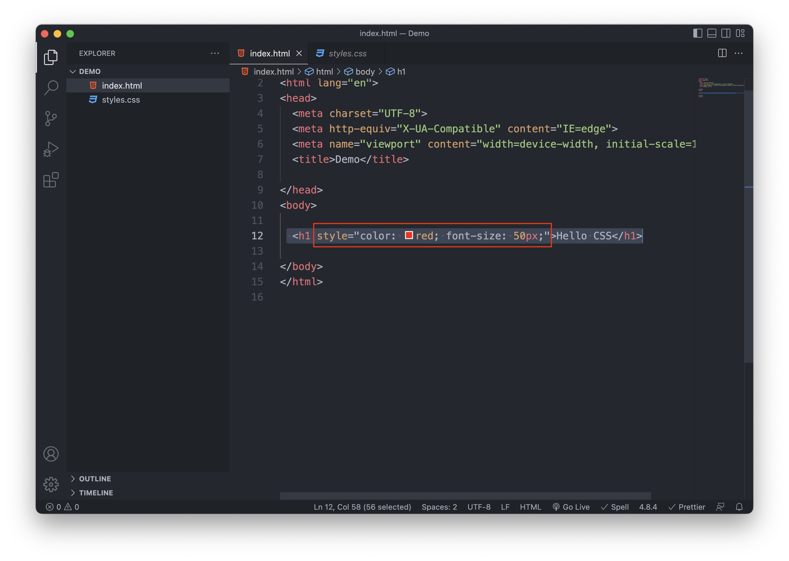
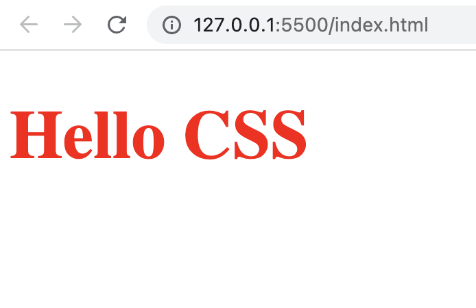
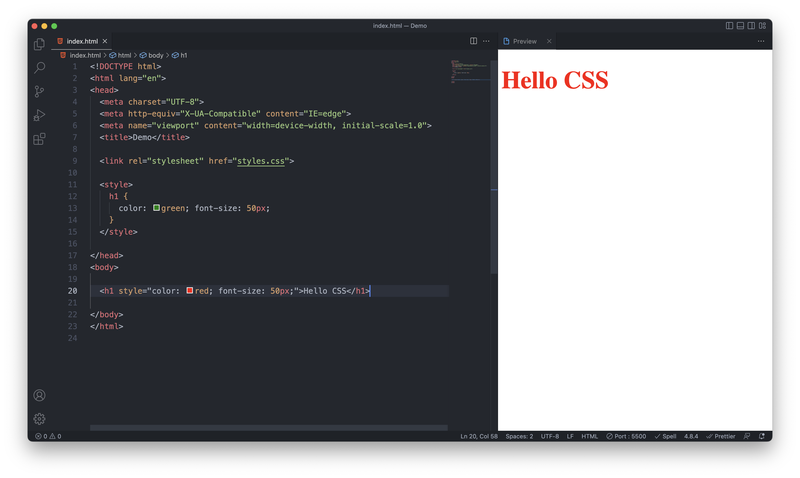
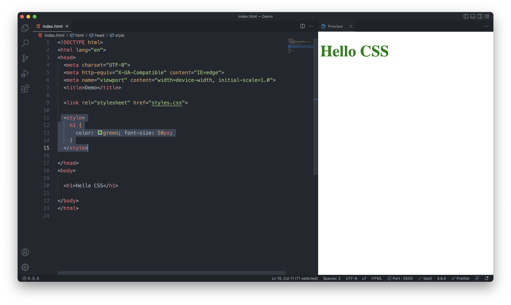

# WTF CSS 极简教程: 2. CSS 语法

WTF CSS 教程，总结/搬运自[MDN CSS 教程](https://developer.mozilla.org/zh-CN/docs/Web/CSS)，帮助新人快速入门 CSS。

**推特**：[@WTFAcademy\_](https://twitter.com/WTFAcademy_) ｜ [@0xAA_Science](https://twitter.com/0xAA_Science)

**WTF Academy 社群：** [官网 wtf.academy](https://wtf.academy) | [WTF Solidity 教程](https://github.com/AmazingAng/WTFSolidity) | [discord](https://discord.wtf.academy) | [微信群申请](https://docs.google.com/forms/d/e/1FAIpQLSe4KGT8Sh6sJ7hedQRuIYirOoZK_85miz3dw7vA1-YjodgJ-A/viewform?usp=sf_link)

所有代码和教程开源在 github: [github.com/WTFAcademy/WTF-CSS](https://github.com/WTFAcademy/WTF-CSS)

---

这一讲，我们介绍 CSS 语法，以及在文档中应用 CSS 的三种方式。

## 语法

CSS 规则集由选择器和声明块组成，如下图所示：

 

选择器指向你要设置样式目标元素。

声明块由 `{` 开始，`}` 结束。

声明块包含一条或多条声明, 声明之间使用 `;`分隔。

每条声明都包含一个 CSS 属性名称和一个值，以 `:` 分隔。

上图代码意思是：所有 `<h1>` 元素的文本颜色为红色，文本大小为 50 个像素。

## 引入方式

在 HTML 中我们有三种使用 CSS 的方式：

1. 外部 CSS
2. 内部 CSS
3. 行内 CSS

### 外部 CSS

要使用外部 CSS ，首先要创建 CSS 文件。一个 CSS 文件要以 `.css` 扩展名保存，如下图所示。


为了把 `styles.css` 和 `index.html` 连接起来，可以在 HTML 文档中，`<head>` 标签里面加上下面的代码：

```html
<link rel="stylesheet" href="styles.css" />
```



`<link>` 标签里面，我们用属性 `rel`，让浏览器知道有 CSS 文档存在（所以需要遵守 CSS 样式的规定），并利用属性 `href` 指定，寻找 CSS 文件的位置。

### 内部 CSS

内部 CSS 样式，是在 `<head>` 内使用 `<style>` 标签定义，如下图所示。


### 行内 CSS

行内样式（也称内联样式）可用于为单个元素应用唯一的样式。

它的使用方法是直接将 `style` 作为属性，添加到目标元素上，规则如下图所示。



以上三种引入 CSS 的方式都可以达到相同的效果，使页面中的 `<h1>` 元素的文本颜色为红色，文本大小为 50 个像素。 如下图所示。


但我们最常用的还是外部 CSS ，这可以使 HTML 与 CSS 分离。

### 层叠顺序

这时候你可能会有疑问，如果我同时使用其中两种或者三种，那么元素会优先使用那种样式呢？

下面这个 Demo 可以解决你的疑惑。


如上图所示，我们在外部、内部、内联 CSS 中，给 `<h1>` 元素 分别指定文本颜色为蓝色、绿色、红色。此时产生的效果如下图所示。



此时我们把内联样式去掉。



改变外部 CSS 与内部 CSS 顺序。


由以上 Demo 我们可以得出结论，如果我们同时使用多种 CSS ，它们的优先级为：

1. 行内样式
2. 外部和内部样式表（优先级取决于所在位置，后面的覆盖前面的)
3. 浏览器默认样式 （不引入任何 CSS 时，浏览器默认的样式）

## 总结

这一讲，我们知道了如何编写 CSS 样式，以及不同的引入方式，其中行内样式具有最高的优先级，并且将覆盖外部和内部样式以及浏览器默认样式。
